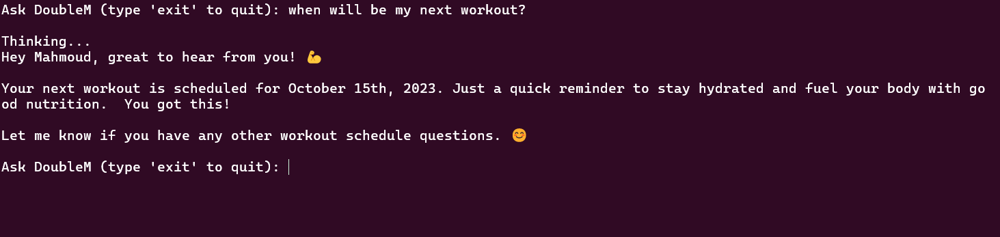
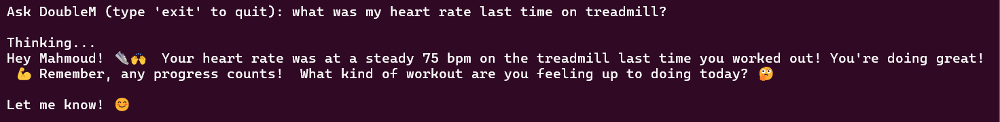

# Workout-chatbot
## overview
This project is a conversational fitness assistant called "DoubleM" It interacts with users by 
answering their questions about workout routines and health-related information. The 
system integrates data from multiple sources, such as PDF workout plans, CSV health logs, 
and user records stored in a SQL database. To generate its responses, it utilizes Hugging 
Face's API through OpenAI python package.


## Features

- Extracts text from CSV and PDF files.
- Sets up prompts for user interaction.
- Provides motivational and encouraging responses.
- Logs in users and retrieves personal and health data.
- Responds to user queries about workout plans and health data.

## Important Attributes

- `get_api_key(filename)`: Reads the API key from a file.
- `extract_text_from_csv(csv_path)`: Extracts text from a CSV file.
- `extract_text_from_pdf(pdf_workout_path)`: Extracts text from a PDF file.
- `set_up_prompt(question, personal_data, health_data, workout_data)`: Sets up the prompt for the chatbot.
- `start_chat(personal_data, pdf_path, csv_path)`: Starts the chatbot interaction loop.
- `log_in()`: Logs in the user and retrieves personal data.

## Data Sources

- CSV files containing health data logs.
- PDF files containing workout plans.

## Package Requirements

To run this project, you need to install the following Python packages:

- `PyPDF2`
- `openai`
- `pandas`

You can install the required packages using `pip`:

```sh
pip install PyPDF2 openai pandas
```

## Usage

1. Ensure you have the necessary API key stored in `api_key.txt`.
2. Place your health data CSV file and workout plan PDF file in the appropriate directory.
3. Run the `fitness_chatbot.py` script:
   ```sh
   python fitness_chatbot.py
   ```
4. Follow the prompts to interact with the chatbot.
## Results







## License

This project is licensed under the MIT License.

## Acknowledgements

- Hugging Face API for the conversational interface.
- PyPDF2 for PDF text extraction.
- Pandas for CSV data handling.

